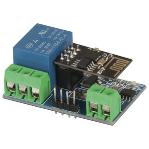
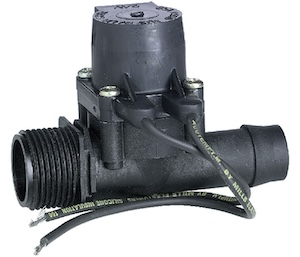
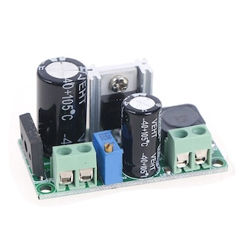
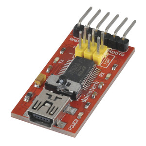
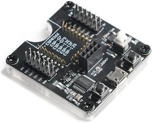

# ESP8266-Sprinkler-Controller

Simple single zone sprinkler controller using ESP Home and a generic ESP8266 Wi-Fi Relay Module.

## Software

This uses the [`Sprinkler Controller`](https://esphome.io/components/sprinkler) component from [ESPHome.io](https://esphome.io/).

I have mine integrated with [HomeAssistant](https://www.home-assistant.io/) for control, scheduling, and weather monitoring (rain detection, hot weather etc.)

### ESPHome Config

An example config file can be found here: [`sprinkler-controller-simple.yaml`](esphome/sprinkler-controller-simple.yaml)

The Sprinkler Controller component is extremely flexible and extendable to many complex configurations.

---

## Hardware

### ESP Board

I use a generic ESP8266 module that is integrated with a relay board

I was able to get mine from Jaycar in Australia, but you can get them extremely cheaply online from many sources.

<https://www.jaycar.com.au/smart-wi-fi-relay-main-board/p/XC3804>

### Solenoid

Any 24v irrigation solenoid will work, I'm using a 19 mm Mini Barb Solenoid.

### Power

I wanted to use a single power supply for the solution, and as irrigation solenoids are usually 24VAC, I simply used a basic LM259 AC to DC Converter Module to power the relay board.

## Programming

These can be programmed OTA, but depending on what the device is initially programmed with, it may need an initial flash to work.

The ESP8266 can be programmed with a standard USB to Serial Adaptor via the headers on the relay board, or as the module is detachable, it can be removed and connected to a ESP test/programming  board.

